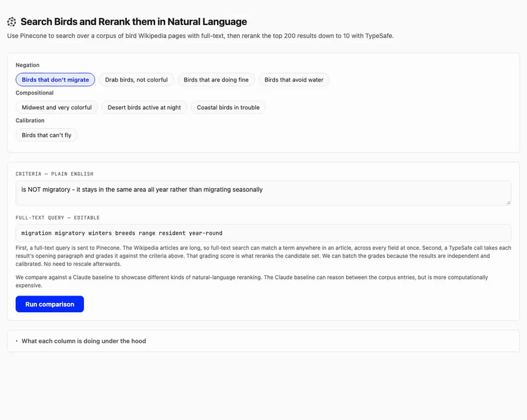

# nli-reranking

Pinecone full-text search retrieves 200 bird articles; TypeSafe's Jev model reranks them to 10
against criteria you write in plain English. A Claude baseline does the same job in one
long-context call, for comparison. No embeddings anywhere.



## Quickstart

Keys live in the repo-root `.env` (see [`.env.example`](../../.env.example)). `PINECONE_API_KEY`
and `TYPESAFE_API_KEY` are required; `ANTHROPIC_API_KEY` is optional.

```bash
npm install
npm run ingest   # creates the index and loads 2,155 articles; once, ~2 minutes
npm run dev
```

Prefer the terminal:

```bash
npm run compare                          # every preset
npm run compare -- --only=no-migrate     # one preset
npm run compare -- "birds that nest in cliffs and are not seabirds"
```

## Measured

Per query, over 200 candidates, averaged across the eight presets:

| Stage                               | Latency   | Cost        |
| ----------------------------------- | --------- | ----------- |
| Pinecone FTS (200 candidates)       | 80–480 ms | negligible  |
| TypeSafe (200 concurrent judgments) | ~1.0 s    | **$0.0041** |
| Claude Opus 5 (1 call)              | ~5.5 s    | **$0.177**  |

Jev bills input only, at $0.042/M. Concurrency drives the TypeSafe number: 16 in flight takes
~2.4 s, 32 takes ~1.2 s, 64 takes ~0.9 s. Set `TYPESAFE_CONCURRENCY` to change it, and watch the
1,200 req/min account limit — one query spends a sixth of a minute's budget.

Both sides report from live `usage`, so the badges in the UI are measured, never hardcoded.

## How it works

**Retrieve wide.** One `documents.search` call, BM25 over `bird_name`, `intro`, and the body
fields, `topK: 200`. `includeFields` returns only the name and opening paragraph — that bounds the
response and yields the snippet the reranker will judge.

**Judge narrow.** One `systemOne` request per candidate, 64 in flight, each carrying only that
bird's name and snippet plus your criteria, asking a single `noul` question. The answer is a
calibrated 0–1 probability, used directly as the sort key. No candidate sees another, so the scores
stay comparable across the whole set.

There is no TypeSafe batch endpoint — the parallelism is a concurrency pool over independent
requests. Packing candidates into one request would blow the state limit and destroy the
independence that makes the scores comparable.

**Compare.** Both rerankers receive the same frozen candidate array and the byte-identical criteria
string. They run sequentially, not concurrently, so 200 TypeSafe sockets don't contend with
Claude's request and skew both timings. Results stream as NDJSON, so each column renders when its
own result lands.

## The presets

Grouped by what they demonstrate. Negation is the sharpest: BM25 ranks documents that use a term
_most_, so asking for the opposite of a word surfaces exactly the wrong set.

| Preset                       | BM25 top result      | TypeSafe top result             |
| ---------------------------- | -------------------- | ------------------------------- |
| Birds that don't migrate     | Black phoebe         | Black-tailed gnatcatcher (0.98) |
| Drab birds, not colorful     | Red-and-green macaw  | White-winged dove (0.80)        |
| Birds that are doing fine    | Sierra Madre sparrow | Mallard (0.86)                  |
| Birds that avoid water       | Chinese pond-heron   | Horned lark (0.59)              |
| Midwest and very colorful    | Sharp-tailed grouse  | Northern cardinal (0.82)        |
| Desert birds active at night | Cactus wren          | Elf owl (0.98)                  |
| Coastal birds in trouble     | Piping plover        | Yellow-headed parrot (0.88)     |

The drab and doing-fine rows show the inversion most plainly: BM25 opens with a macaw and with a
critically endangered sparrow, because those articles use the words "colorful" and "endangered"
most.

**Birds that can't fly** exists to show calibration. The corpus has essentially no flightless birds,
so every score lands under 0.20 — 0.14 on the last run — and the UI says "no strong matches"
instead of ranking ten non-answers.

Presets ship hand-tuned lexical expansions. Free-text criteria get naive keyword extraction
instead, so the full-text query is shown as an editable field — you can watch recall change while
the criteria stay fixed.

## Things worth knowing

**The reranker only sees the opening paragraph**, capped at 700 characters. Full-text search covers
the whole article, but the judgment does not. Click any result to open the reader; the graded
paragraph is highlighted separately from the rest.

**Lead paragraphs need care.** Taking the first blank-line paragraph returns a bare Latin binomial
or a stray map caption for roughly half of these articles. `leadParagraph` requires prose and falls
back on 9 of 2,155.

**Pinecone rejects a field over 10k tokens or 100k bytes**, and a rejected document fails its whole
batch. Long articles split across `body`, `body_overflow`, and `body_overflow_2`, and all are
scored, so nothing is truncated.

**Indexing is asynchronous.** A finished upsert does not mean the documents are searchable; the
ingest polls until a sentinel query returns.

**The Claude column is opt-in.** Without `ANTHROPIC_API_KEY` it isn't rendered at all, leaving a
two-column layout. `CLAUDE_BASELINE=off` forces the same with a key present.

## Scripts

| Script                | Does                                                                               |
| --------------------- | ---------------------------------------------------------------------------------- |
| `npm run dev`         | Next.js dev server                                                                 |
| `npm run ingest`      | Create the index and load the corpus (`--recreate`, `--sample N`, `--create-only`) |
| `npm run compare`     | Run presets or a custom query in the terminal                                      |
| `npm run check`       | Typecheck, lint, format, tests — offline, spends nothing                           |
| `npm run record-demo` | Re-record `docs/demo.gif` (needs the dev server and `ffmpeg`)                      |

## Layout

```
src/lib/       corpus, pinecone, rerank-typesafe, rerank-claude, compare, presets, pricing
src/scripts/   ingest, compare, record-demo
src/app/       Next.js UI and the /api/compare and /api/article routes
data/          article text and the id → image map
```

The engine is a plain library, so the CLI and the UI both drive it and the core is testable without
a browser.
